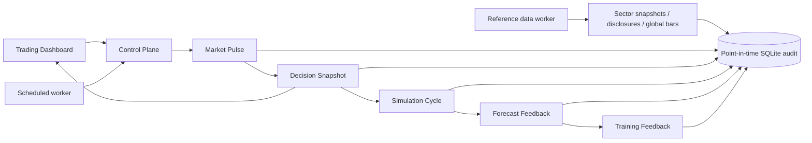

# Control Plane 运行架构

Control Plane 是当前主运行入口。`full` profile 将过去分散的能力收敛为固定业务顺序：Market Pulse → Decision Snapshot → Simulation Cycle → Forecast Feedback → Training Feedback，同时保留旧接口兼容性。辅助性的 `market_data_refresh` 只会在行情不新鲜时插入 Decision Snapshot 之前，不改变业务步骤的先后关系。



## 运行配置

| Profile | 内容 | 默认时段 |
| --- | --- | --- |
| `pulse` | Market Pulse → Decision Snapshot | 盘前 |
| `full` | Market Pulse → Decision Snapshot → Simulation Cycle → Forecast Feedback → Training Feedback | 盘中、收盘复盘 |
| `maintenance` | Market Pulse → Decision Snapshot → Forecast Feedback → Training Feedback；不运行 Simulation Cycle | 非交易时段 |
| `training` | Forecast Feedback → Training Feedback | 手工诊断 |
| `adaptive` | 按上海时区自动选择以上配置 | 常驻 worker |

所有配置都先检查 `live_trading_enabled=false`。任何步骤的业务结果为 `partial`、`blocked` 或 `failed` 时，Control Plane 会保留该语义，不会仅因 HTTP/函数调用成功而标记为完成。

## 五步链路语义

1. **Market Pulse** 将决策截止时间前可见的政策、新闻和跨市场材料规范化为 Event Fact。Market Intelligence 根据来源层级、方向、强度、可用时间和跨市场特征形成带 horizon、decay、invalidation、industry-chain edges 的 Sector Thesis，并将板块预测写入 Forecast Ledger。
2. **Decision Snapshot** 读取当时有效的板块成员关系和 Sector Thesis，将板块先验映射到股票，再计算可观察双头结构代理。生成的股票排名和证据按 1/3/5/10/20 日 horizon 写入 Forecast Ledger。
3. **Simulation Cycle** 只消费当前已完成、行情门禁通过且包含候选的 Decision Snapshot。快照不可用时记录 `skipped_decision_not_ready`，不会重新走一套旁路扫描代替它。
4. **Forecast Feedback** 处理已到期的 stock/sector forecast。股票以下一交易日 open 为入口、第 h 个交易日 close 为终点；板块使用决策 cutoff 内最新成分快照的完整成分等权收益，并对齐指数基准窗口。它报告 coverage、Precision@K、Spearman Rank IC 和仅针对明确语义概率的 Brier；样本不足时返回 `insufficient_data`。
5. **Training Feedback** 在 Forecast Feedback 之后运行，继续生成原有安全任务样本、到期标签和质量汇总。它不能自动改写活动规则，也不能开启执行权限。

上述顺序描述的是已落地调用链，不表示预测已经取得稳定准确率或收益。任何概率、排名和评估指标都必须结合样本量、fold 数、数据覆盖与 point-in-time 完整性解释。

## Forecast Ledger 与 point-in-time 约束

`forecast_decisions` 保存不可变的板块和股票预测，关键字段包括：

- `decision_id`、scope、subject 和 1/3/5/10/20 日 horizon；
- `decision_cutoff` 与 `available_at`；
- rank、score、probability；
- model、prompt、data version；
- 特征、证据、原因和 review-only 状态。

同一预测身份不能被不同 payload 覆盖；变化需要新的 `decision_id`。`as_of` 只返回 `decision_cutoff` 与 `available_at` 均不晚于查询截止时间的完整快照。

`forecast_outcomes` 由 Forecast Feedback 在到期后写入。股票连续收益、市场基准收益、行业收益及其中性收益分别保存；行业基准不可用时会显式标记 `benchmark_proxy_not_observed_industry_return`，不能把 proxy 描述成实测行业收益。

`forecast_evaluations` 幂等保存每个 scope/horizon 的评估快照。样本量和指标语义达到门禁后，系统可自动生成 `agent_calibration_proposals`，但提案只能进入人工复核/challenger/sandbox，不会自动替换活动评分规则。

## 事件、板块暴露与双头结构门控

- Event Fact 保存 event/cluster identity、实体、地域、方向、强度、发布时间、首次发现时间、检索时间、`available_at`、revision、source tier、证据 URL 和 raw hash。系统可用时间不会早于实际检索时间。
- Sector Thesis 是可证伪的 review-only 假设，不是新闻标题直接加分；它带预测方向、时间范围、衰减规则和失效条件。
- 手工/历史来源可继续使用 `sector_membership_history` 区间。外部 board adapter 使用 append-only `sector_membership_snapshots` 与 member 表；每个 source/sector 在 cutoff 内只选最新完整快照，因此移出和重新加入都不会改写旧决策。
- Observable Structure Scorer 分别输出 `pre_markup_probability` 和 `distribution_probability`。当数据完整度足够且派发概率达到门槛时，`distribution_veto` 压低成熟度并加入 `STRUCTURE_DISTRIBUTION_VETO`；板块利好不能绕过该否决。

该结构 Module 只使用可观察的价格、成交量、均线、位置和上影线等代理，不声称直接识别“庄家”，也不是实盘许可。

## Disclosure Fact

`DisclosureLedger` 为资产负债表、利润表、现金流量表、业绩预告、回购、减持、解禁、定增和重大合同提供不可变事实入口。每条记录带 `published_at`、`first_seen_at`、`retrieved_at`、`available_at`、source、raw hash、revision、metrics 和 evidence；相同 payload 幂等，修订必须连续且不能倒置可用时间。

`feature_summary` 只汇总事实类型和数值指标，不输出买卖建议。当前回购 adapter 已真实接入，并从 canonical disclosure hash 排除动态最新价与排序序号；其他披露类型仍需按交易所/监管源逐个接入和验证。

Simulation Cycle 与 Decision Snapshot 还共享同一行情门禁：只接受有效 OHLC、允许的质量状态、至多一个交易日时差且最新横截面覆盖率不低于 80% 的日线缓存。逐候选判断会再次检查自身最后一根日线，避免单只最新数据掩盖其余候选过期。

生产环境的交易日差优先使用 AKShare/Sina 沪深交易日历，并在进程内缓存 6 小时；只有远端日历不可用时才退回工作日估算，状态接口会显式标记 `weekday_fallback`。冷启动或行情落后时，首轮最多选择 25 只最旧/缺失候选，以 5 个并发下载补齐 180 日缓存，目标是在一个有界周期内达到 80% 横截面覆盖，而不是等待多个 15 分钟轮次。

前置覆盖门禁通过后，Simulation Cycle 仍会对 auto-discovery 新加入的每一只实际候选重算交易日新鲜度；收盘后缺少当日交易数据、日期在未来或只剩静态档案价格时，均写入 `plan_skipped/stale_market_snapshot`，不会生成可用模拟计划或训练正样本。

板块利好不会因单一媒体标题直接提高判断：只有新鲜的官方正向政策，或至少两个独立发布域名给出同向新鲜证据时才允许正向加分；新鲜风险证据会压制该加分并进入复核路径。所有证据保留来源 URL、发布时间状态和检索时间，供后续回放。

固定来源抓取与 Codex 深度检索可以交错运行。`latest_context` 会在最近 24 小时内优先选择“完成、无质量告警、至少两个有效来源”的最新批次；较新的单源占优或部分失败批次仍保留为抓取诊断，但不会立即覆盖更高质量的 Codex 上下文。响应同时返回 `latest_capture_run_id` 与实际采用的 `run_id`，便于审计选择原因。

任意 `source_urls` 网络抓取被禁用，以消除 DNS 重绑定造成的 SSRF 时间窗口；扩展来源应通过只保存结构化证据、不主动回连 URL 的 `/api/public-opinion/evidence/ingest`。内置四个 HTTPS 来源必须精确匹配仓库白名单域名，重定向也不得跨主机。

## 参考数据 worker

`backend/scripts/reference_data_loop.py` 不改变 Control Plane 五步顺序，而是独立补齐 Decision Snapshot 和 Market Pulse 依赖的参考 ledger。`run_stack.ps1` 启动后立即跑一轮，之后每 4 小时运行：

- 东方财富行业/概念 + 新浪行业兜底，写入不可变完整成分快照；
- AKShare 回购事实，写入 canonical、revision-safe Disclosure Fact；
- 前复权 `SMH`/`NVDA`，以及明确标记为未调整连续合约的 `CL`/`GC`/`BTC`；`SOX` 为可选慢源。

所有数据的 `available_at` 不早于实际请求返回时间。全球行情修订通过 append-only revision 保留，查询先选 cutoff 内最新 revision 再过滤质量；不会回退到被新修订否定的旧 ready 值。美股当日未收盘 bar 保持 `provisional`。

worker 使用 OS 单例锁、900 秒子进程超时与 `backend/logs/reference_data_heartbeat.json`。它仅在 `live_trading_enabled=false` 时写本地参考 ledger；无 broker 、账户或委托能力。单源失败返回 `partial`，不会把兜底成功冒充为全源完整。

## 全市场日线 backfill

Control Plane 的有界 refresh 只修复当前候选范围；建立全沪深 A 股研究底座应使用独立的 `backfill_market_universe.py`。清单发现有两个独立外部路径；只有外部全量清单成功才标为 `complete_external`。若只能从本地缓存、profile 和生命周期恢复已知代码，状态固定为 `degraded_local_partial`，不得解释为全市场覆盖。命令默认 dry-run，不写数据库：

```powershell
cd D:\codex-A股交易\backend
.\.venv\Scripts\python.exe -X utf8 scripts\backfill_market_universe.py `
  --days 500 `
  --batch-size 200
```

确认股票发现和数据源可用后，显式 `--apply` 才允许写 `daily_bar_cache`：

```powershell
.\.venv\Scripts\python.exe -X utf8 scripts\backfill_market_universe.py `
  --apply `
  --days 500 `
  --batch-size 200 `
  --rate-limit-seconds 0.5
```

任务支持 `--resume-after SH600000` 和 `--limit 200`。失败按股票隔离，结果报告 bar coverage、`amount` completeness、latest cross-section coverage，以及 Forecast Feedback 所需的 `SH000300` / `SH000001` reference data。基准失败单独报告并使任务至少为 `partial`，不污染股票成功/失败计数。网络或 provider 失败会返回结构化错误，不会静默宣称回填完成。`--apply` 仅允许日线缓存写入，不改变 review-only / simulation-only 安全边界。

## 接口

```text
GET  /livez
GET  /readyz
GET  /health
GET  /api/control-plane/status
POST /api/control-plane/run-once
```

手工执行一次维护周期：

```powershell
Invoke-RestMethod -Method Post `
  -ContentType "application/json" `
  -Body '{"profile":"maintenance","limit":30,"requested_by":"manual_review"}' `
  http://127.0.0.1:8000/api/control-plane/run-once
```

## 常驻 worker 与 Windows ensure

`backend/scripts/control_plane_loop.py` 每个调度槽先读取 `/health`，只有明确返回 `live_trading_enabled=false` 才调用 Control Plane。心跳写入 `backend/logs/control_plane_heartbeat.json`，日志与 PID 均位于 Git 忽略目录。

`backend/scripts/reference_data_loop.py` 每 4 小时刷新参考 ledger，心跳写入 `backend/logs/reference_data_heartbeat.json`。它的异常/超时只会将该轮降级并记录，不会跳过 live-disabled 门禁。

```powershell
backend\.venv\Scripts\python.exe -X utf8 backend\scripts\control_plane_loop.py `
  --profile adaptive `
  --interval-seconds 900 `
  --max-cycles 0
```

`backend/scripts/codex_market_pulse.py` 使用本机已登录的 Codex CLI，以 `--ephemeral --sandbox read-only` 运行网络研究，并受 JSON schema 约束。它只把带 URL、检索时间、发布时间状态和事实摘要的证据提交到 `/api/public-opinion/evidence/ingest`；不向后端保存 OpenAI 凭据，也不允许 Computer Use。

提交批次前，worker 会逐条复用 evidence API 的 Pydantic 契约进行校验。单条证据的时间、长度或枚举不合规时，只拒绝该条并在心跳中记录 `submitted_count`、`rejected_count` 和 `validation_errors`；其余合规证据继续批量提交，整轮降级为 `partial`，不会自动篡改时间、截断事实，也不会因一条坏数据丢弃整个批次。输出 schema 同步约束 URL、标题、摘要和来源名称的后端长度契约，并要求具体文章/公告 URL 与来源域名一致，禁止通用主页和搜索结果页；若整轮为 `failed`、`blocked`，或 `partial` 且没有一条有效证据，下一轮缩短为 15 分钟重试，得到有效证据后恢复 4 小时间隔，`next_interval_seconds` 会写入心跳。

`scripts/run_stack.ps1` 默认每 4 小时启动一次 Codex 搜索。关闭该可选进程：

```powershell
.\scripts\run_stack.ps1 -EnableCodexSearch:$false
```

停止时使用 `scripts/stop_stack.ps1`。启动器记录每个进程的 PID、可执行路径、完整命令行和创建时间；停止器全部匹配后才会终止进程和删除 PID 文件。

`scripts/ensure_stack.ps1` 是幂等健康入口：它检查 `/health`、`/readyz`、前端，以及 Control Plane / reference-data / Codex 舆情 worker 的心跳和受跟踪进程身份，要求 `live_trading_enabled=false`；健康时返回 `already_running`，不健康时只通过受跟踪 PID 停止旧进程，再调用 `run_stack.ps1` 并复验安全状态。

```powershell
cd D:\codex-A股交易
.\scripts\ensure_stack.ps1
```

可选的 Windows Scheduled Task 不会随代码自动安装，需显式执行：

```powershell
.\scripts\control_plane_task.ps1 -Action Status
.\scripts\control_plane_task.ps1 -Action Install -EnsureIntervalMinutes 5
.\scripts\control_plane_task.ps1 -Action RunOnce
.\scripts\control_plane_task.ps1 -Action Uninstall
```

安装会创建当前用户、Limited 权限的 `ZKTrading-ReviewOnly-ControlPlane` 任务，在登录时和设定间隔调用 ensure。任务使用 `MultipleInstances IgnoreNew`，不会并发启动多个 ensure。安装或触发后必须再次检查：

```powershell
(Invoke-RestMethod http://127.0.0.1:8000/health).live_trading_enabled
Invoke-RestMethod http://127.0.0.1:8000/readyz
```

第一条必须返回 `False`。Scheduled Task 只提高本地进程可恢复性，不增加 broker、账户或下单权限。

## 运行期查询与闭环观测

Forecast Feedback 的一次 `label_due` 调用会在运行内复用板块成分、股票日线和基准窗口。板块成员日线按最多 800 个 symbol 分批读取，并在 1/3/5/10/20 日 horizon 间复用；缓存不会跨运行或跨 cutoff 共享。这样查询次数由“成员数 × horizon”收敛为有限的批量查询，同时保持原有 point-in-time 结果口径。

Sector Exposure 的 snapshot cutoff 使用规范化 UTC ISO 时间直接比较，保留微秒精度。全市场目录的外部 adapter 不可用时，Universe Backfill 还会从 append-only 板块成分快照和 legacy membership history 恢复本地已知股票池；该回退仍标记为 `degraded_local_partial`，不会冒充完整全市场目录。

前端右栏的 Control Plane Observatory 只轮询 `GET /readyz` 与 `GET /api/control-plane/status`，页面隐藏时暂停、恢复时立即刷新，不会自动触发运行。它展示三个 worker、Market Pulse、Decision Snapshot、Forecast Feedback 和 Training Feedback；当 `forecast_outcomes=0` 时明确提示当前不能评价准确率。只有操作员点击原有控制面按钮时才会调用 `POST /api/control-plane/run-once`，并展示该次运行返回的逐步状态。

## 验收条件

- `/livez` 能区分进程存活。
- `/readyz` 能报告数据库、worker 心跳和安全状态。
- `/health` 始终明确返回 `live_trading_enabled=false`。
- `full` 控制周期按 Market Pulse、Decision Snapshot、Simulation Cycle、Forecast Feedback、Training Feedback 返回逐步状态与耗时。
- Simulation Cycle 的输入能追溯到同一轮不可变 Decision Snapshot；快照不可用时显式跳过。
- 到期 stock/sector forecast 能形成 point-in-time Outcome；样本不足时评估明确为 `insufficient_data`，不输出未经支持的准确率结论。
- 舆情上下文包含来源覆盖、新鲜度、Event Fact、Sector Thesis、板块信号和证据链接。
- 全市场 backfill 显式区分 dry-run/apply，并报告 bar、amount 与最新横截面覆盖。
- Disclosure Fact 修订、Sector Exposure 和 Forecast Ledger 的 `as_of` 查询均不返回截止时间以后才可用的数据。
- reference-data worker 具有单例、有界超时、心跳和进程身份验证；某个数据源失败时保留结构化 `partial` 证据。
- 前端显示真实状态，不再用静态新闻掩盖后端离线。

当前真实 adapter 已覆盖跨市场行情、板块成分与回购，但不代表全市场、全公告类型或全来源已完整。连续期货换月跳空、源端稳定性和数据新鲜度必须持续监控。聚焦测试、少量 Outcome、回测完成或启发式概率均不能单独证明未来准确率或收益。

## 兼容与后续拆分

`backend/app/api/routes.py` 与 Dataset2 遗留审批链暂时保留，避免一次性改写造成回归。新功能不再继续扩张该 interface；后续依据真实调用证据把遗留路由隔离到可选 router，再删除无调用的浅 module。
