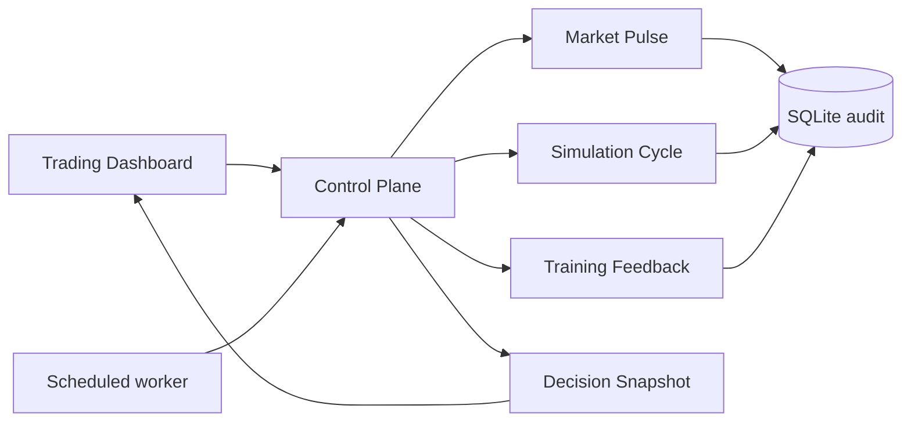

# Control Plane 运行架构

Control Plane 是当前主运行入口。它把过去分散的舆情抓取、模拟周期、训练样本、结果标注和候选判断收敛为一个可调度接口，同时保留旧接口兼容性。



## 运行配置

| Profile | 内容 | 默认时段 |
| --- | --- | --- |
| `pulse` | 舆情捕捉、候选快照 | 盘前 |
| `full` | 舆情、模拟周期、训练反馈、候选快照 | 盘中、收盘复盘 |
| `maintenance` | 舆情、训练反馈、候选快照，不运行完整盘中周期 | 非交易时段 |
| `training` | 仅增量样本、到期结果和质量汇总 | 手工诊断 |
| `adaptive` | 按上海时区自动选择以上配置 | 常驻 worker |

所有配置都先检查 `live_trading_enabled=false`。任何步骤的业务结果为 `partial`、`blocked` 或 `failed` 时，Control Plane 会保留该语义，不会仅因 HTTP/函数调用成功而标记为完成。

Simulation Cycle 与 Decision Snapshot 还共享同一行情门禁：只接受有效 OHLC、允许的质量状态、至多一个交易日时差且最新横截面覆盖率不低于 80% 的日线缓存。逐候选判断会再次检查自身最后一根日线，避免单只最新数据掩盖其余候选过期。

生产环境的交易日差优先使用 AKShare/Sina 沪深交易日历，并在进程内缓存 6 小时；只有远端日历不可用时才退回工作日估算，状态接口会显式标记 `weekday_fallback`。冷启动或行情落后时，首轮最多选择 25 只最旧/缺失候选，以 5 个并发下载补齐 180 日缓存，目标是在一个有界周期内达到 80% 横截面覆盖，而不是等待多个 15 分钟轮次。

前置覆盖门禁通过后，Simulation Cycle 仍会对 auto-discovery 新加入的每一只实际候选重算交易日新鲜度；收盘后缺少当日交易数据、日期在未来或只剩静态档案价格时，均写入 `plan_skipped/stale_market_snapshot`，不会生成可用模拟计划或训练正样本。

板块利好不会因单一媒体标题直接提高判断：只有新鲜的官方正向政策，或至少两个独立发布域名给出同向新鲜证据时才允许正向加分；新鲜风险证据会压制该加分并进入复核路径。所有证据保留来源 URL、发布时间状态和检索时间，供后续回放。

固定来源抓取与 Codex 深度检索可以交错运行。`latest_context` 会在最近 24 小时内优先选择“完成、无质量告警、至少两个有效来源”的最新批次；较新的单源占优或部分失败批次仍保留为抓取诊断，但不会立即覆盖更高质量的 Codex 上下文。响应同时返回 `latest_capture_run_id` 与实际采用的 `run_id`，便于审计选择原因。

任意 `source_urls` 网络抓取被禁用，以消除 DNS 重绑定造成的 SSRF 时间窗口；扩展来源应通过只保存结构化证据、不主动回连 URL 的 `/api/public-opinion/evidence/ingest`。内置四个 HTTPS 来源必须精确匹配仓库白名单域名，重定向也不得跨主机。

## 接口

```text
GET  /livez
GET  /readyz
GET  /health
GET  /api/control-plane/status
POST /api/control-plane/run-once
```

手工执行一次维护周期：

```powershell
Invoke-RestMethod -Method Post `
  -ContentType "application/json" `
  -Body '{"profile":"maintenance","limit":30,"requested_by":"manual_review"}' `
  http://127.0.0.1:8000/api/control-plane/run-once
```

## 常驻 worker

`backend/scripts/control_plane_loop.py` 每个调度槽先读取 `/health`，只有明确返回 `live_trading_enabled=false` 才调用 Control Plane。心跳写入 `backend/logs/control_plane_heartbeat.json`，日志与 PID 均位于 Git 忽略目录。

```powershell
backend\.venv\Scripts\python.exe -X utf8 backend\scripts\control_plane_loop.py `
  --profile adaptive `
  --interval-seconds 900 `
  --max-cycles 0
```

`backend/scripts/codex_market_pulse.py` 使用本机已登录的 Codex CLI，以 `--ephemeral --sandbox read-only` 运行网络研究，并受 JSON schema 约束。它只把带 URL、检索时间、发布时间状态和事实摘要的证据提交到 `/api/public-opinion/evidence/ingest`；不向后端保存 OpenAI 凭据，也不允许 Computer Use。

`scripts/run_stack.ps1` 默认每 4 小时启动一次 Codex 搜索。关闭该可选进程：

```powershell
.\scripts\run_stack.ps1 -EnableCodexSearch:$false
```

停止时使用 `scripts/stop_stack.ps1`。启动器记录每个进程的 PID、可执行路径、完整命令行和创建时间；停止器全部匹配后才会终止进程和删除 PID 文件。

## 验收条件

- `/livez` 能区分进程存活。
- `/readyz` 能报告数据库、worker 心跳和安全状态。
- `/health` 始终明确返回 `live_trading_enabled=false`。
- 控制周期有 Market Pulse、Simulation Cycle、Training Feedback、Decision Snapshot 的逐步状态与耗时。
- 已完成自动化能形成训练样本；到期样本能形成 Outcome。
- 舆情上下文包含来源覆盖、新鲜度、板块信号和证据链接。
- 前端显示真实状态，不再用静态新闻掩盖后端离线。

## 兼容与后续拆分

`backend/app/api/routes.py` 与 Dataset2 遗留审批链暂时保留，避免一次性改写造成回归。新功能不再继续扩张该 interface；后续依据真实调用证据把遗留路由隔离到可选 router，再删除无调用的浅 module。
