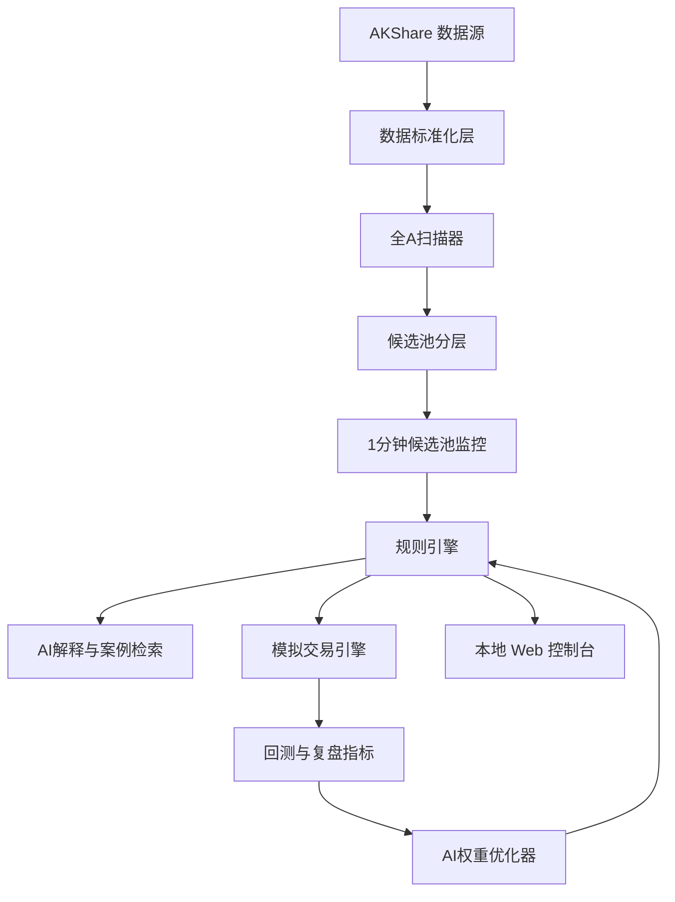

# 技术路线

## 1. 总体架构

## 2. 技术选型

- 后端：Python 3.11+、FastAPI、Pydantic。
- 数据源：AKShare 优先，后续可扩展 Tushare。
- 存储：SQLite 优先，后续迁移 PostgreSQL。
- 配置：YAML/JSON 文件 + Web 控制台。
- 前端：Vue 3 + TypeScript。
- AI模型：可插拔接口，预留 OpenAI、通义千问、本地模型。

## 3. 阶段规划

### 阶段一：知识库和规则底座

- 导入现有原则库、战法库、案例库和交易记录。
- 建立本地 SQLite 表。
- 建立规则配置文件。
- 实现规则命中解释。

产出：能回答“为什么这只股票被选入/剔除”。

### 阶段二：行情和候选池

- 接入 AKShare 日线和分钟数据。
- 建立股票池基础信息缓存。
- 实现集合竞价/开盘阶段全A扫描。
- 实现强候选、观察候选、剔除名单。

产出：每天自动生成盘中监控列表。

### 阶段三：灯盏策略和模拟盘

- 实现低位强势股筛选。
- 实现涨停后情景一/情景二识别。
- 实现强制分歧点、5日均线趋势、主力出货信号。
- 实现严格 A股模拟交易约束。

产出：可在模拟盘中执行买卖并复盘。

### 阶段四：AI解释和案例联想

- 接入可插拔 LLM。
- 建立相似案例检索。
- 生成提醒解释、风险提示、复盘总结。

产出：每条提醒都有规则、案例和风控依据。

### 阶段五：AI调权和验证

- 根据模拟表现生成权重调整候选。
- 用收益、最大回撤、胜率、盈亏比验证。
- 只接受综合改善的权重版本。

产出：策略权重可自动迭代，但不触碰实盘权限。

## 4. 数据迁移路径

第一版用 SQLite 降低部署成本。后续如果需要云端运行，可按以下路径迁移：

1. SQLite 表结构稳定。
2. 增加仓储接口层。
3. 替换为 PostgreSQL 实现。
4. 增加 Redis 用于行情缓存和任务状态。
5. 增加向量数据库用于案例检索。

## 5. 关键工程风险

- 免费行情源字段和稳定性可能变化。
- 全A盘中高频扫描会遇到性能和限流问题。
- AI解释容易过度自信，必须受规则和风控约束。
- 模拟撮合如果过于简化，会给出虚假的策略收益。
- 自动调权需要防止过拟合。
